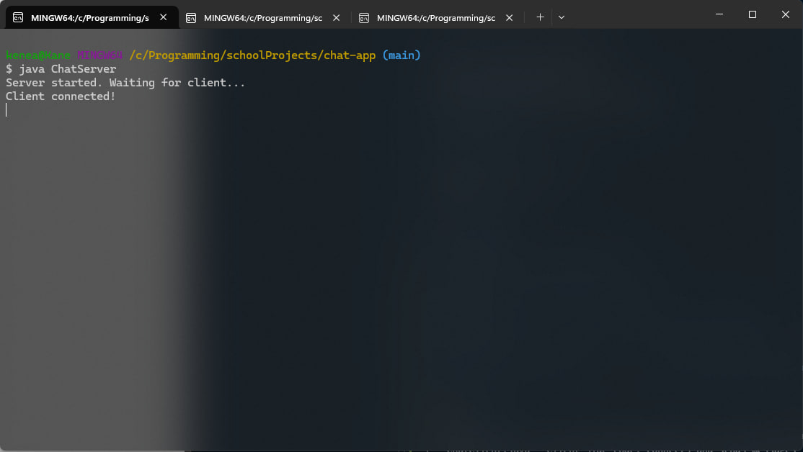
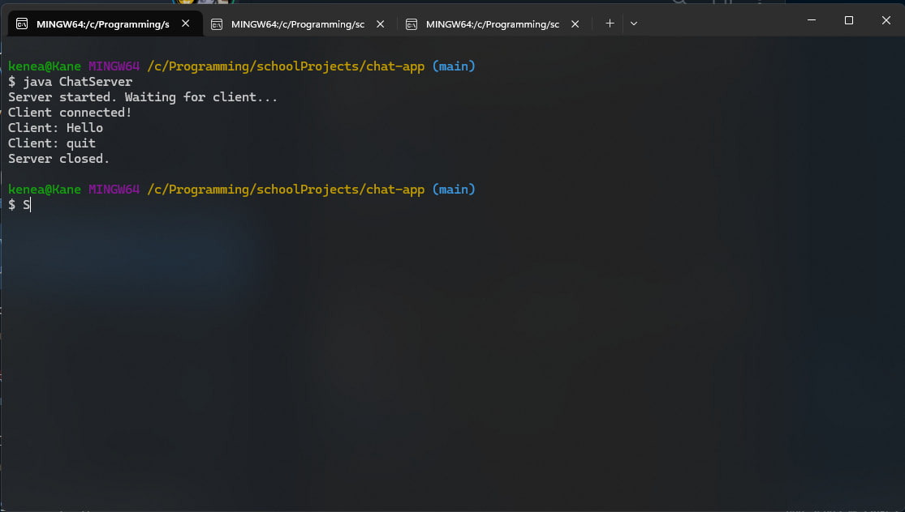
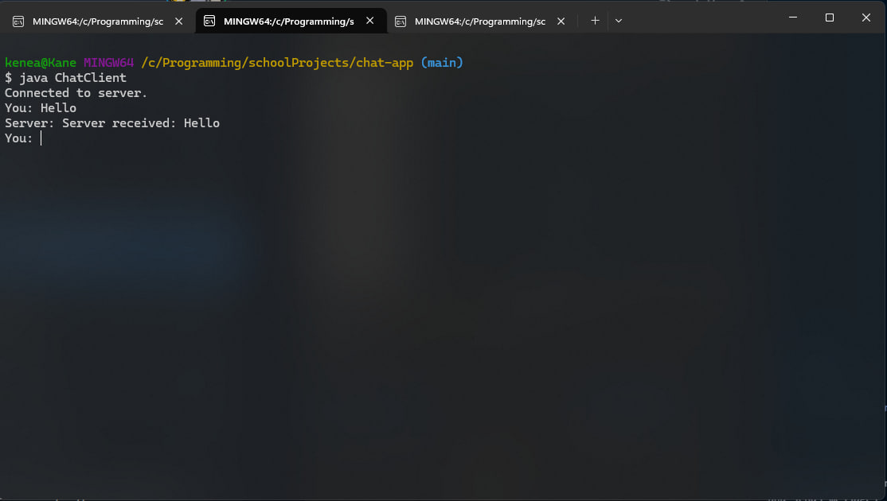
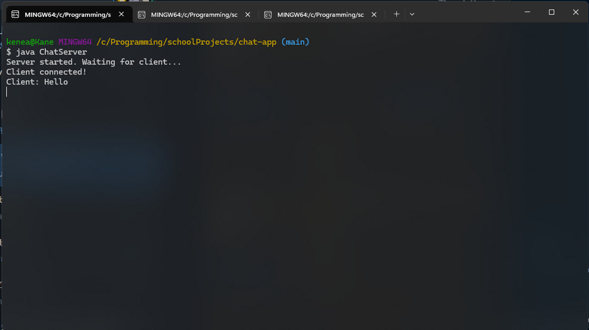
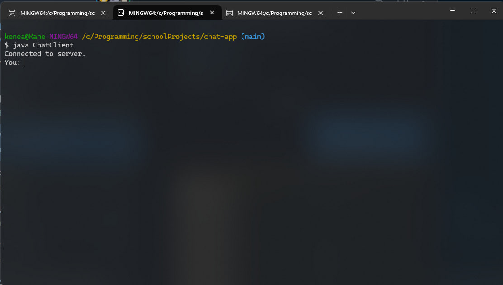

# Java Client-Server Chat Application

A simple Java-based client-server chat application demonstrating basic socket communication. The server accepts one client connection and echoes back each message with a confirmation. The interaction continues until the client sends the `"quit"` command to end the session.

## Table of Contents

- [Features](#features)
- [Technologies](#technologies)
- [How to Run](#how-to-run)
- [Examples (Screenshots)](#examplesscreenshots)
- [Structure](#structure)
- [Group Members](#group-members)

## Features

- Simple TCP socket communication
- Server listens on port `1234`
- One client can connect and chat
- Communication ends with `"quit"` command
- Minimal and beginner-friendly Java code

## Technologies

- Java 8+ (tested on Java 24)
- Sockets
- Input/Output Streams

## How to Run

### 1. Compile  
javac ChatServer.java ChatClient.java

### 2. Run the server ChatServer file first  
java ChatServer

### 3. Then start the client file ChatClient and send messages  
java ChatClient

### 4. Then to finish/quit write `quit` on the ChatClient terminal and just write quit

## Examples(Screenshots)

Here are screenshots showing the execution of the chat application:

### 1. Server starts and waits for client

### 2. Client connects to server

### 3. Client sends message

### 4. Server receives and responds

### 5. Client sends "quit"

### 6. Server terminates

## Structure

chat-app/  
├── Screenshots  
├── ChatServer.java – Server-side code: accepts one client and responds  
├── ChatClient.java – Client-side code: connects and sends messages  
└── README.md – Project overview and instructions

## Group Members

- Fikir Samuel  
- Fitsum  
- Dagim Bireda  
- Kenean Alemayhu